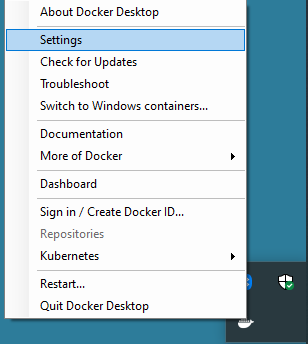
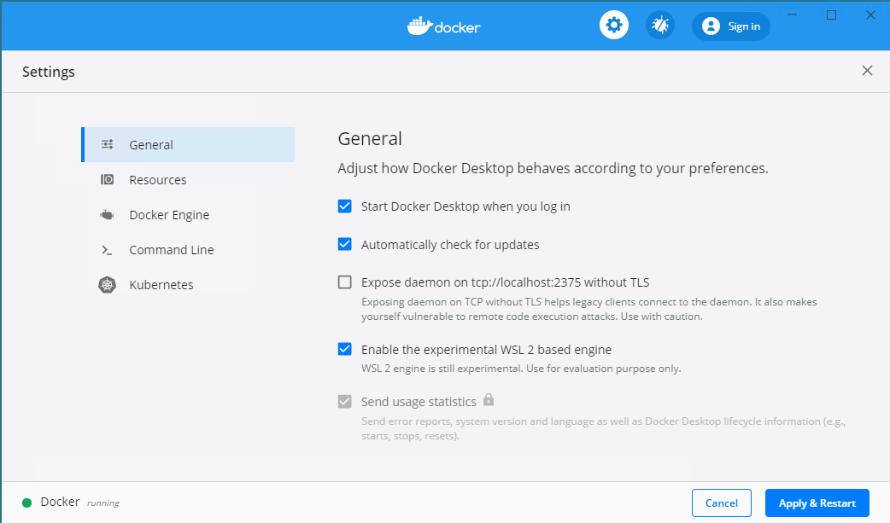

## Prerequisites


- **Docker Desktop Community 2.1.5.0** or later - see [Docker Desktop for Windows Edge]
- Windows 10 Insider build 18990 or later - see [Getting Windows 10 Insider Preview](/docs/user/using-wsl2#Getting-Windows-10-Insider-Preview)
- Support for Intel VT or AMD-V instructions, on hardware and from the hypervisor if you are running Windows in a VM

### Configuring Docker for WSL2

Kind currently builds and runs Linux containers. Make sure that Docker is configured to run Linux containers. Right-click the Moby icon on the taskbar, and choose "Switch to Linux containers" if it's listed. In the screenshot below - it's already running Linux containers so no change is needed.



To enable WSL2, click on Settings in that menu.



Go to the "General" page, tick the "Enable the experimental WSL2 based engine" box, then click "Apply & Restart"

Now, open a PowerShell window, and run `docker run hello-world` to make sure it's ready to go.

```none
PS c:\users\patrick> docker run hello-world
Unable to find image 'hello-world:latest' locally
latest: Pulling from library/hello-world
1b930d010525: Pull complete                                                                                             Digest: sha256:c3b4ada4687bbaa170745b3e4dd8ac3f194ca95b2d0518b417fb47e5879d9b5f
Status: Downloaded newer image for hello-world:latest

Hello from Docker!
This message shows that your installation appears to be working correctly.

To generate this message, Docker took the following steps:
 1. The Docker client contacted the Docker daemon.
 2. The Docker daemon pulled the "hello-world" image from the Docker Hub.
    (amd64)
 3. The Docker daemon created a new container from that image which runs the
    executable that produces the output you are currently reading.
 4. The Docker daemon streamed that output to the Docker client, which sent it
    to your terminal.

To try something more ambitious, you can run an Ubuntu container with:
 $ docker run -it ubuntu bash

Share images, automate workflows, and more with a free Docker ID:
 https://hub.docker.com/

For more examples and ideas, visit:
 https://docs.docker.com/get-started/
```

## Running Kind


## Merging kubeconfig


## Building images


> TODO - is this a new issue?

```
PS C:\Users\plang\go\src\k8s.io> dir


    Directory: C:\Users\plang\go\src\k8s.io


Mode                 LastWriteTime         Length Name
----                 -------------         ------ ----
d-----         11/4/2019   6:03 PM                kubernetes


PS C:\Users\plang\go\src\k8s.io> cd ..
PS C:\Users\plang\go\src> cd ..
PS C:\Users\plang\go> kind build node-image
ERRO[18:17:40] Failed to build Kubernetes: failed to build binaries: fork/exec build/run.sh: %1 is not a valid Win32 application.
Error: error building node image: failed to build kubernetes: failed to build binaries: fork/exec build/run.sh: %1 is not a valid Win32 application.
```


## Using a newer kubectl

> TODO - Docker puts a shipped version in PATH

```
get-command kubectl

CommandType     Name                                               Version    Source
-----------     ----                                               -------    ------
Application     kubectl.exe                                        0.0.0.0    C:\Program Files\Docker\Docker\resources\bin\kubectl.exe


PS C:\Users\plang> kubectl version
Client Version: version.Info{Major:"1", Minor:"15", GitVersion:"v1.15.5", GitCommit:"20c265fef0741dd71a66480e35bd69f18351daea", GitTreeState:"clean", BuildDate:"2019-10-15T19:16:51Z", GoVersion:"go1.12.10", Compiler:"gc", Platform:"windows/amd64"}
Server Version: version.Info{Major:"1", Minor:"15", GitVersion:"v1.15.5", GitCommit:"20c265fef0741dd71a66480e35bd69f18351daea", GitTreeState:"clean", BuildDate:"2019-10-15T19:07:57Z", GoVersion:"go1.12.10", Compiler:"gc", Platform:"linux/amd64"}
```


[Docker Desktop for Windows Edge]: https://docs.docker.com/docker-for-windows/edge-release-notes/